# MEND by CTRL+ALT

**Team:** Sofea, Am, Nureen, Adib
**Problem Statement:** Stress & Workload Manager
**Video Presentation:** [YouTube Link](https://youtu.be/T2aLGoV10n8)
**Presentation Slides:** [Canva Slides](https://canva.link/5amu5lt7hhb7ay6)

---

## 1. Project Overview

**The Problem.** University students juggle lectures, work shifts, and multiple deadlines at once, and burnout rarely comes from one big thing — it's everything piling up quietly until it's too late. The core issue isn't that students manage their time badly; it's that they have no visibility into their actual capacity on a given day, so they keep saying yes, keep deprioritizing what "feels" less urgent, and run on empty before they notice. Existing tools solve one half of this each: planners organize the *what*, and mental-health apps address the *mind*, but nothing connects the two into a same-day decision.

Two apps shaped our thinking here. **Rencana**, a student planner, handles timetables, deadlines, and tasks well — but it doesn't know whether the student behind that schedule can actually handle it today. **Unstuck**, a CBT journaling app for anxiety and depression, surfaces a user's thinking/behavior patterns over time — but it works after the fact, through reflection, not in the moment a student is deciding what to do next. MEND borrows the pattern-awareness spirit of Unstuck and applies it to the planning structure of Rencana's category, merging both into one live, same-day capacity decision.

**Our Solution.** MEND reframes burnout as a **capacity problem, not a time problem**. Each day, it measures what a student can actually handle (energy, sleep, stress, focus) against what's being demanded of them (classes, work, tasks), then restructures the day around that gap — protecting recovery time and reordering tasks by priority instead of urgency alone. It doesn't just visualize the overload; it intervenes.

### Feature Set

- Capacity score from a quick check-in using **SVG icon states** (energy/sleep/stress/focus) — no raw numbers shown to the user, no emoji
- Weighted task priority (Deadline 40% + Importance 30% + Consequence 20% + Effort fit 10%)
- Adaptive day plan that allocates today's actual capacity to the highest-priority tasks first, with protected recovery blocks
- **Burnout Debt** — a running trend showing sustained overload, not just a single day's score
- User-initiated recheck-in (e.g. after a nap) that live-updates the rest of the day's plan
- **"Future You" simulation** comparing Follow MEND vs Push Through outcomes for tomorrow's capacity
- Every recommendation carries **Accept / Adjust / Keep Anyway** — the app never silently reschedules anything
- Daily check-in reframed as **"What are we feeling today?"** — two paths: tap through simple icon states directly, or write freely about your day and let Gemini extract energy/sleep/stress/focus. Either path always ends with the same locked formula computing Capacity
- Quick-add task in natural language — AI extracts deadline/importance/consequence/effort, with the same confirm-before-use step as the check-in path
- Class timetable input with two paths: fill in a weekly grid manually, or upload a photo/PDF and let AI extract class times — kept separate from tasks since classes are fixed commitments, not flexible work
- **Mirror Pet** — a mascot that visually reflects the user's real capacity/burnout state (bright and upright when healthy, tired and dim when overloaded). No feed/water/care actions — it's a passive emotional mirror, not a virtual pet to manage
- **NLP-based distress detection** — user's free-text check-in is screened for severe distress language; if triggered, a hardcoded crisis banner (not LLM-judgment-dependent) immediately surfaces local helpline contacts
- **Strict LLM boundary** — the AI is explicitly framed as "a place to say what happened," never a therapist substitute; users are always pointed toward real professional help for actual support

---

## 2. Ideation & Process

### 2.1 Ideas We Considered

| Idea | Status | Why |
|---|---|---|
| Weighted capacity/priority formula (40/30/20/10) | ✅ Chosen | Deterministic and fully explainable in the pitch — every number on screen can be traced back to a rule, which matters for trust in a burnout tool |
| Priority-based capacity allocation | ✅ Chosen | Splitting available hours by task priority (e.g. 1.5h to the most urgent task) instead of cutting every task equally — respects that not all overload is equal |
| User-initiated recheck-in | ✅ Chosen | Lets the plan adapt after rest without any background/silent monitoring — kept user agency and trust as a locked constraint |
| Behavior-pattern onboarding question ("When things pile up, what usually happens to you?") | ✅ Chosen | Inspired by Unstuck's pattern-detection approach, adapted for daily capacity. Shapes copy tone, recovery block type, and Burnout Debt phrasing only |
| AI-assisted check-in — "what are we feeling" path | ✅ Chosen | Instead of forcing everyone through manual icon taps, users can type freely and Gemini extracts energy/sleep/stress/focus — closer to Unstuck's actual journaling mechanic. Extracted values always shown back for confirm/adjust before Capacity is calculated |
| AI-assisted quick-add task | ✅ Chosen | Same extraction pattern applied to task entry — type naturally, Gemini fills deadline/importance/consequence/effort, user confirms before it enters the priority formula |
| AI-assisted timetable upload | ✅ Chosen | Same extraction pattern applied a third time — photo/PDF of a class schedule, Gemini extracts class times, user confirms before it's locked in. Manual weekly-grid entry stays available as fallback |
| **Mirror Pet** | ✅ Chosen — **REAL, building it** | Direct response to mentor Faris's USP challenge. Not a normal pet-care loop (feed/water) — the pet has no care actions. Its condition directly mirrors the user's actual capacity/overload data, making burnout visible without another number on a dashboard |
| **Strict LLM boundary policy** | ✅ Chosen — REAL | LLM is explicitly framed as "a place to say what happened," not a therapist. Users always pointed to real professional help. Directly addresses mentor Varsha's privacy/risk concern |
| **NLP-based crisis detection banner** | ✅ Chosen — REAL | If check-in text contains severe distress signals, an immediate hardcoded banner surfaces local helplines (Talian Kasih 15999, Befrienders KL 03-7627 2929). Hardcoded and not left to LLM judgment alone, since this is a safety-critical path |
| **Journal reframe** ("what are we feeling today?") | ✅ Chosen — REAL | "Journal" felt dated per mentor Varsha's feedback; reframed as a daily prompt instead |
| **Calendar retrospective view** | ✅ Chosen — REAL (simple version) | Users can browse back through the calendar and see how they felt on past days — a mood-over-time view, extending the journal reframe |
| **Telegram bot for schedule extraction** | 🔵 Considered — **ROADMAP, pitch only** | Suggested by mentor Varsha, since Malaysian students run class schedules through Telegram/WhatsApp group chats. Strong future direction, but out of scope for this prototype's build window — mentioned in the pitch as a next-round feature, not built |
| Fuzzy logic for capacity scoring | ❌ Dropped | Harder to justify and explain live to judges within hackathon time, and risked being misrepresented as "AI-powered" when a transparent weighted formula was more honest and just as effective |
| Blanket time-reduction across all tasks | ❌ Dropped | Cutting every task by the same amount ignores that a report due tomorrow and a poster due next week are not equally urgent |
| Real calendar OAuth integration | ❌ Dropped for this build | Mocked calendar data was sufficient to prove the concept without absorbing auth/integration risk in a 3-week window |
| Full "app learns your patterns" personalization | ❌ Dropped to roadmap | Kept as a stated future direction rather than something we'd claim as built |
| Silent/automatic background check-ins | ❌ Dropped | Conflicts with our locked design principle that MEND never acts without the user initiating it |
| Diagnosis/label-based grouping (e.g. "which group: stress/ADHD/depression") | ❌ Dropped | Read as a clinical intake form rather than MEND's voice, and risked being challenged for having no clinical basis. Replaced with the behavior-pattern question, which achieves the same personalization without labeling the user |
| Streak/badge retention mechanics | ❌ Dropped | Mentor Faris flagged streaks alone as not optimal for retention — team had already independently doubted this before the session |
| Normal pet-care loop (feed/water pet) | ❌ Dropped in favor of Mirror Pet | Early version of the pet idea (Am/Sofea's original concept) — replaced once the team aligned on the mirror-state mechanic instead, since it ties directly back to the app's core capacity data rather than being a separate game loop |

### 2.2 Ideation Boards

We have created interactive HTML diagrams for our ideation process. Click the links below to view them:

- [Mindmap Diagram](./mend-mindmap.html)
- [App Flow Diagram / IPO Walkthrough](./mend-ipo-walkthrough.html)
- [Rubric Alignment Map](./mend-rubric-alignment.html)
- [App Screen Flow](./mend-app-screen-flow.html)

### 2.3 Mentor Consultation

| Date | Mentor | Feedback Received | What Was Changed |
|---|---|---|---|
| 10/9/2026, 8:30pm | Faris Imran *(led by Sofea)* | Said our UI/UX is quite heavy on text. Asked directly: what's our unique selling point vs other apps — team went quiet on this. We mentioned "Future You" as a differentiator but he said still not it. We then explained the vent/diary input concept (LLM extracts capacity signals from free text) — he said good starting point, but still not enough to make users stay/keep using MEND. We mentioned streak as a retention idea — he said streak alone is not an optimal way to keep users coming back, gave TikTok as reference for what actually hooks people. Challenged us on how to make the vent space itself a more unique experience. | Sparked the **Mirror Pet** concept as the direct response to the USP gap |
| 10/9/2026 *(led by Nureen)* | Varsha | Said we should NOT let LLM act as a therapist — flagged this as a real privacy/risk concern. She liked the journal part of our concept. Suggested reframing away from "journal" (feels old) toward something like "what are we feeling for today?" as a daily prompt instead. Encouraged us to use NLP to predict stress/burnout from user's text input. Asked if we could integrate with Telegram — since Malaysian students run everything through Telegram/WhatsApp class group chats, could we extract schedule info directly from those messages instead of manual entry? | **Journal reframe**, **strict LLM boundary policy**, **NLP-based crisis detection** (built into prototype), and **Telegram bot concept** (flagged as roadmap/next-round, not built this round) |

*Note even where we disagreed with a piece of feedback, we're engaging with it here rather than only listing what we accepted — e.g. the original pet-care idea wasn't wrong, it was just a different mechanic from what best answered the USP challenge.*

---

## 3. Design & Prototype

**UI Prototype:** [Stitch Project](https://stitch.withgoogle.com/projects/480461036867296632)

MEND's visual direction is a **light-theme, Discord-inspired layout** (clean panel-based content grouping, simple nav) built around a single soft mint-green accent color — the same color as the app's mascot and icon. No multi-color status system; urgency is expressed through shade and shape, not additional hues. All icons are custom SVG line icons — **no emoji anywhere in the UI**. Cards and inputs use soft elevation instead of hard borders, keeping the interface sleek and low-text-density (direct response to mentor feedback that earlier versions were too text-heavy).

**The Mascot / Mirror Pet:** A soft mint-green cloud-shaped blob with a simple minimal face, appearing throughout the app as a recurring companion. Its expression shifts based on the user's real capacity/burnout data — bright and content when capacity is healthy, tired and drooping when overloaded. This is not a decorative icon; it's the app's core answer to "what makes us different."

**Key screens**:

| Sign In / Sign Up | Onboarding Behavior | Check-in ("Pour it out") | Capacity Assessment |
| :---: | :---: | :---: | :---: |
| 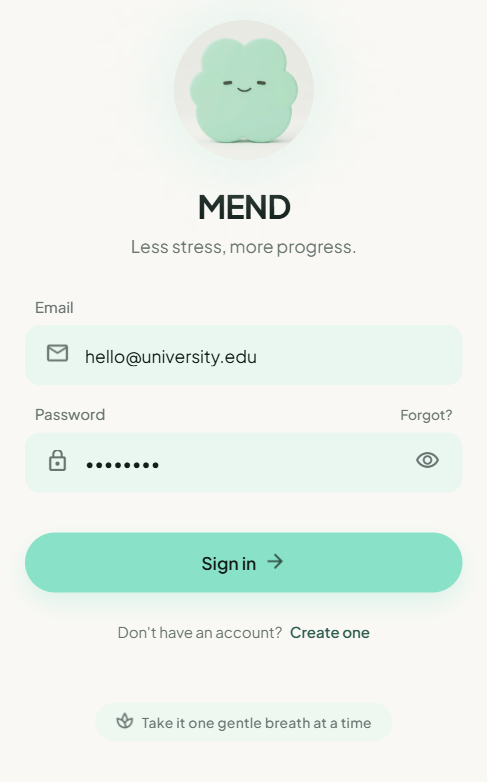 | 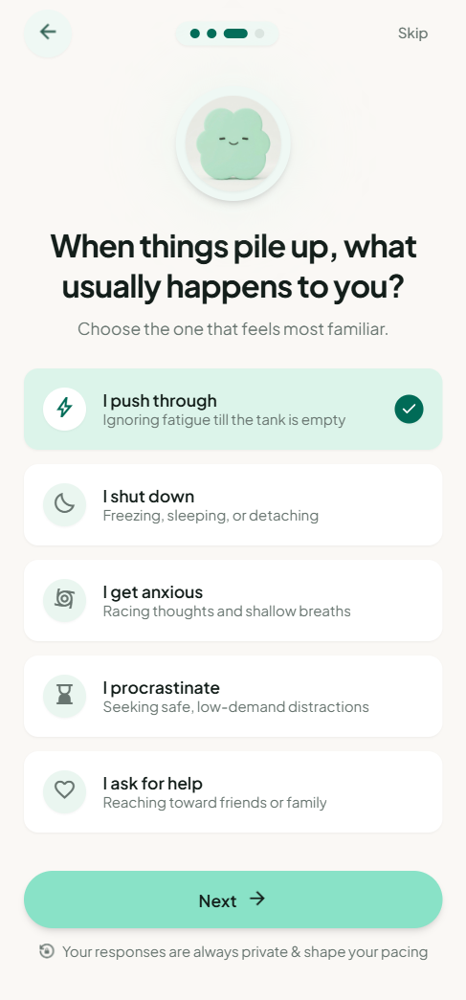 | 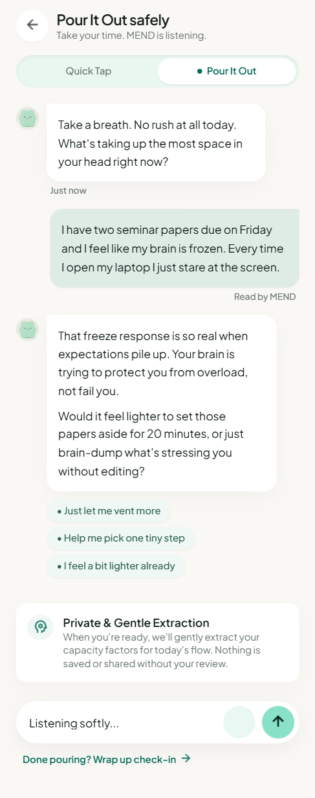 | 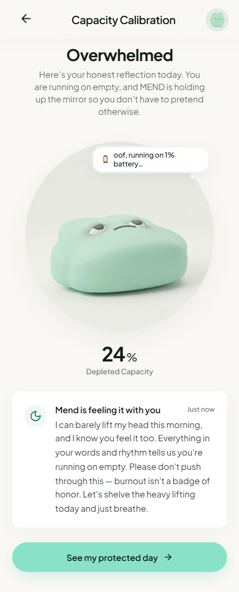 |
| **Add Task (AI Dump)** | **Day Plan** | **Adjustments / Changes** | **Burnout Debt** |
| 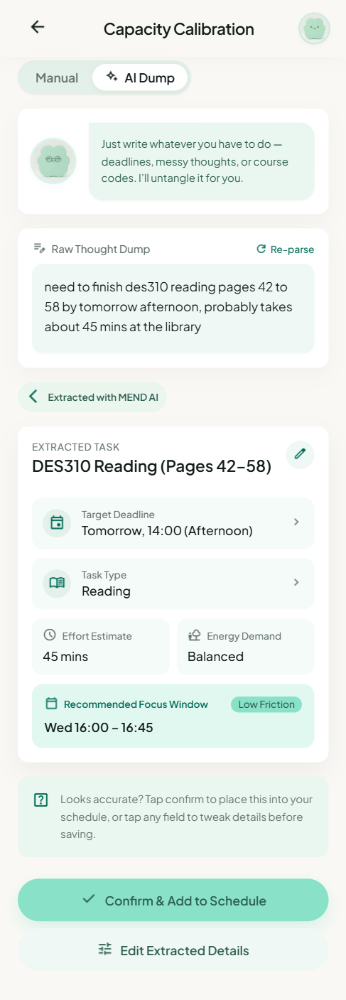 | 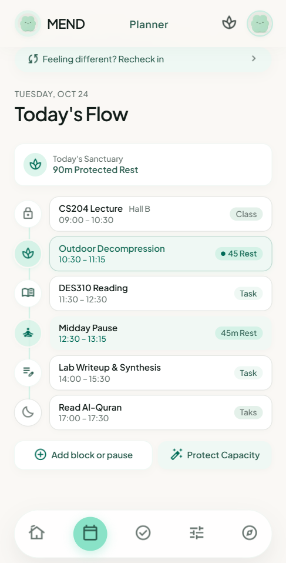 | 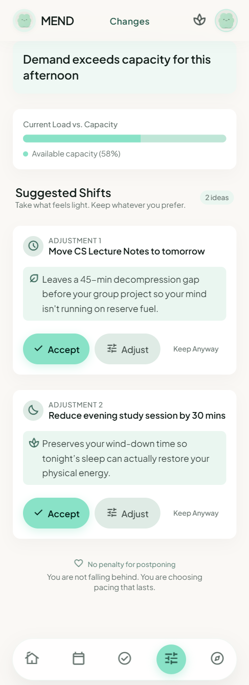 | 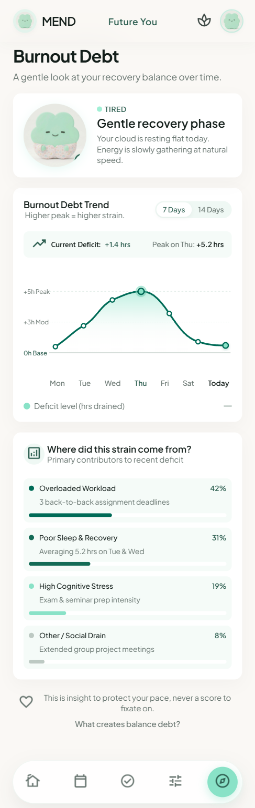 |
| **Future You** | **Calendar Retrospective** | **Crisis Banner** | |
| 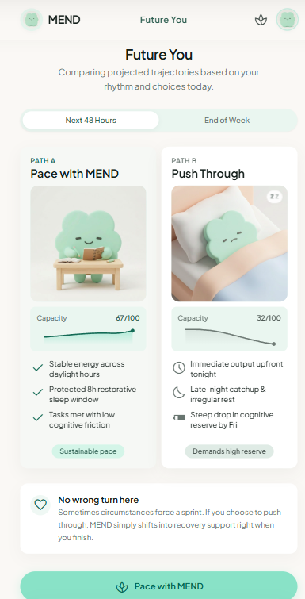 | 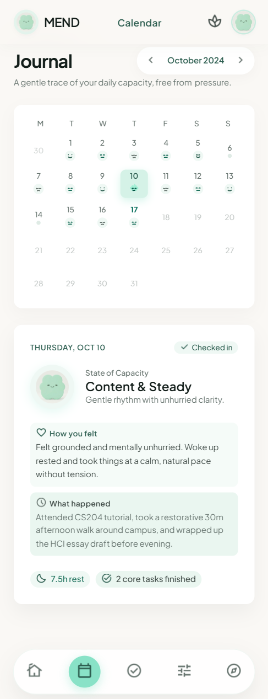 | 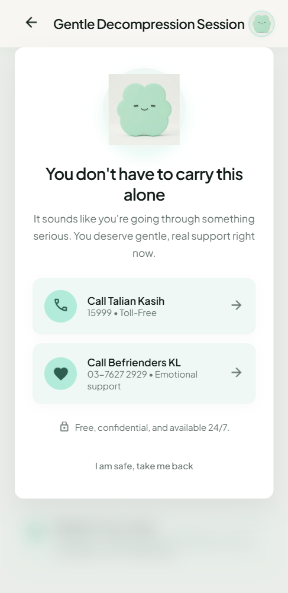 | |

*(Full design system detail: see `design.md`)*

---

## 4. What Makes It Different

**A mascot that shows you your burnout before you feel it.** Most wellness apps hide your state behind a dashboard number. MEND's Mirror Pet doesn't — it's a living reflection of your actual capacity, visible the moment you open the app. No care actions to perform, no separate game to manage: when your pet looks tired, it's because *you* are. This was our direct answer when a mentor challenged us on having no real USP — not another feature, but a different relationship to the data itself.

**You see tomorrow's crash before it happens — and can still stop it.** No planner or wellness app tells you what your body will feel like tomorrow based on what you do today. MEND does. Push through today with 5h of work and 4h of sleep? You'll open the app tomorrow at 31/100 capacity — burnt out, and MEND told you it was coming. Follow the plan instead, and you land at 67/100. Same day, two different tomorrows, and you get to pick which one before you live it.

**It decides for you when you're too depleted to decide well.** When you're at 43/100 capacity, the worst thing an app can do is hand you a list and say "you figure it out." MEND does the triage itself — Report gets 1.5h split with a break in between, Presentation gets bumped to tomorrow, your poster waits, and your recovery block is non-negotiable.

**It knows the difference between "busy" and "burning out."** Demand is what's on your plate, Capacity is what you can actually carry today, and Overload is the gap between them. You've never had a number for that gap before — now you do.

**Burnout Debt remembers what your calendar forgets.** A bad day resets at midnight in every other app. In MEND, it doesn't — Burnout Debt tracks whether you've been quietly overspending your capacity for days, not just today.

**It never moves your life around without asking.** Every recommendation comes with Accept / Adjust / Keep Anyway. MEND can see you're overloaded and still won't touch your schedule unless you say go.

**It knows when to stop being a planner and start being a safety net.** If a check-in signals real distress, MEND doesn't try to coach you through it with AI — it steps back and hands you a real number to call, immediately, hardcoded, no LLM judgment call required.

---

## 5. Technical Architecture & Feasibility

### Tech Stack

| Layer | Choice | Why / Constraints |
|---|---|---|
| Frontend | React + Vite, TypeScript | Matches our clickable prototype's screen structure; type safety helps four people editing the same codebase in parallel without breaking each other's screens |
| Calculation engine | TypeScript, pure functions | The capacity/priority formula is deterministic math, not AI — no need for a server round-trip to compute it |
| APIs | Google Gemini API — three extraction points + distress screening | (1) Check-in: parses free-typed text into energy/sleep/stress/focus. (2) Quick-add task: parses free-typed text into deadline/importance/consequence/effort. (3) Timetable upload: parses a photo/PDF of a class schedule into fixed class times. All three are shown back to the user for confirm/adjust before use. A fourth pass screens check-in text for severe distress language and triggers a hardcoded crisis banner — this detection logic is separate from and does not touch the locked capacity formula |
| Backend/Database | Supabase (Postgres + Auth) | Managed Postgres with built-in auth, generous free tier; stores check-ins, tasks, Burnout Debt history, and calendar retrospective data |
| Hosting | Vercel | One-click deploy from GitHub; judges get a working link, not a local setup |

### System Architecture Diagram

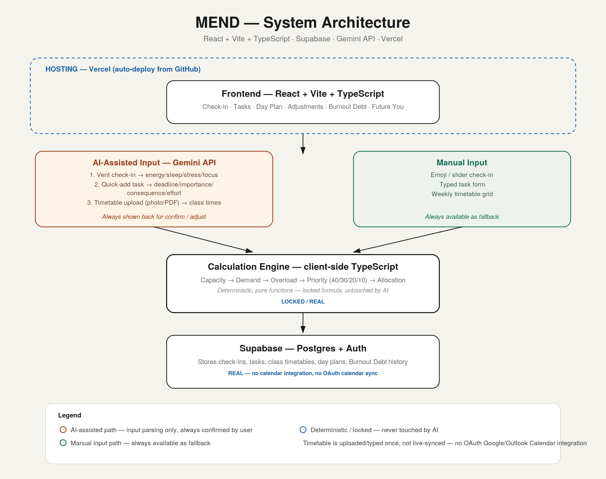

### Build Plan & Scope

**Building this round:**
- Full check-in, task, and timetable flow with AI-assisted + manual paths
- Capacity/Demand/Overload/Priority calculation engine (locked formula)
- Adaptive Day Plan with Accept/Adjust/Keep Anyway
- Burnout Debt trend
- Future You simulation
- Mirror Pet (mascot reflecting capacity state) — REAL
- NLP-based distress detection + hardcoded crisis banner — REAL
- Calendar retrospective (mood-over-time view) — REAL, simple version
- User-initiated recheck-in

**Explicitly NOT building this round (roadmap/pitch only):**
- Real calendar OAuth integration (mocked calendar stays)
- Telegram bot for schedule extraction — mentioned in the pitch as a next-round direction if MEND advances, not built into this prototype
- Full "app learns your patterns" personalization beyond the one real exception (task-duration calibration)
- Custom day-window start/end time (fixed 7:00–23:00 for this prototype)

### Resolved Open Questions
- **Calendar integration:** Hold — mocked for this round, OAuth is a stated roadmap item
- **Diary feature:** Resolved — reframed as "what are we feeling today?" daily prompt, not a traditional diary
